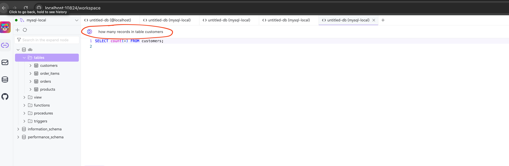

# chat2db_example


architecture

local：
┌────────────┐        ┌────────────┐        ┌────────────┐
│  Chat2DB   │ ─────▶ │   Ollama   │ ─────▶ │ local model│
└────────────┘        └────────────┘        └────────────┘
      │                    │                       │
      ▼                    ▼                       ▼
  MySQL GUI         Prompt to SQL             return SQL


Steps:

1. install docker(colima) 

2. install chat2db via docekr compose

```
# docker-compose.yml
version: '3'
services:
  chat2db:
    image: chat2db/chat2db:latest
    container_name: chat2db
    ports:
      - "10824:10824"
    volumes:
      - ~/.chat2db-docker:/root/.chat2db
```


3. install and start up ollama


```
curl -fsSL https://ollama.com/install.sh | sh
ollama serve &
```

4. install supported model

```
ollama pull fit2cloud/chat2db-sql:7b-q8_0

```

5. configure db connection

* open http://localhost:10824/workspace
* add mysql connection from the left side
  the host should be `host.docker.internal` if your mysql is located inside docker container
  choose to add the mysql driver
  test to make sure the db connection works well

6. add ai model to support the text to sql

* open the custom ai from the chat2db left side
* select custom for the ai model
* leave the api key as empty
* add `http://host.docker.internal:11434/v1/chat/completions/` to apihost since we are using local ollama
* give the model name `fit2cloud/chat2db-sql:7b-q8_0`

Then you can use the ai prompt in chat2db UI page `http://localhost:10824/workspace`




